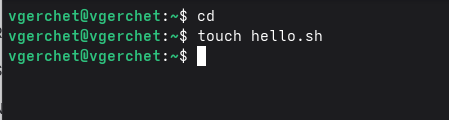
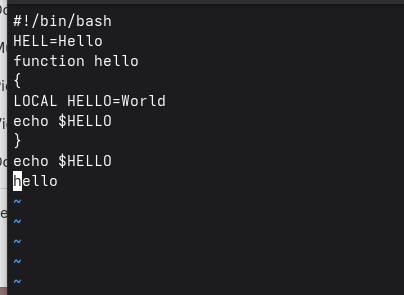
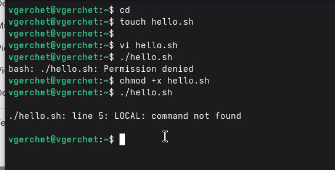
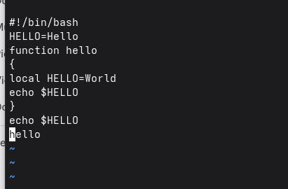
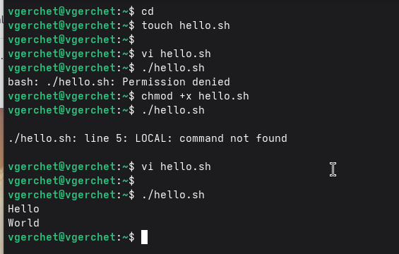

---
## Author
author:
  name:  Герчет Вячеслав
  email: 1132255650@rudn.ru
  affiliation:
    - name: Российский университет дружбы народов
      country: Российская Федерация
      postal-code: 117198
      city: Москва
      address: ул. Миклухо-Маклая, д. 6
	  
## Title
title: Операционные системы
subtitle: Редактор Vi
license: CC BY
date: today
date-format: "YYYY-MM-DD" # Example: 2025-09-06
---

# Цели и задачи работы

## Цель лабораторной работы

Познакомиться с операционной системой Linux. Получить практические навыки работы с редактором vi, установленным по умолчанию практически во всех дистрибутивах.

## Задачи лабораторной работы

1 Изучить возможности редактора Vi

# Процесс выполнения лабораторной работы

## Выполнение работы

{ #fig:001 width=70% height=70% }

## Выполнение работы

{ #fig:002 width=70% height=70% }

## Выполнение работы

{ #fig:003 width=70% height=70% }

## Выполнение работы

{ #fig:004 width=70% height=70% }

## Выполнение работы

{ #fig:005 width=70% height=70% }

# Выводы по проделанной работе

## Вывод

В ходе роботы мы получили практические навыки работы с редактором vi, установленным по умолчанию практически во всех дистрибутивах UNIX. А также освоили основные режимы и команды
